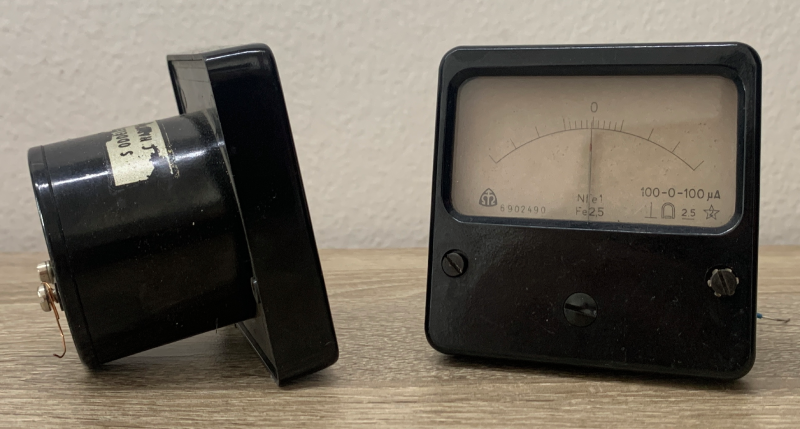

# Analog Panel Meter

I own a couple of very cool and nice looking vintage analog panel meters made by
a Czech company called Metra.

https://www.metra.cz

The company has existed for a long time and the meters I have are from an era
when the company made a wide range of various types of meters.
Most common are ammeters and voltmeters with various scales, but to my knowledge
the company also made sound level meters, temperature (and maybe humidity?)
meters and other meters.

There is a particular type of these meters which I am very fond of the look of:

I'll try to replace this photo with a better one when I feel like setting up a
better environment to shoot these in.

My goal in this repository is to model and print an enclosure these are in and
then figure out how far I want to take this to see if I could replace the analog
guts with digital circuitry.

I don't want to recreate these meters and keep them analog, I don't like these
because I am crazy about analog meters, I like them for the look, so I think
using an AliExpress sensor circuit in combination with an Arduino or a Raspi
will be a better choice for me.

An open question is how to move the indicator needle.
I might remake the coil that's inside which moves it but drive it digitally to
get the same smooth movement or I might try approximating it using a servo with
a gyro attached to get the nice and fluid behavior these have.

As a side note, look at the Metra website to see what kind of meters are still
sold today:

https://www.metra.cz/en/products/digital-panel-and-switchboard-instruments/

Taste is absolutely a subjective thing, but I cannot help but feel like these
don't hold a candle to the sold the vintage ones have.

This repository documents the process, which is currently ongoing.
I will attempt to keep this readme up to date.

## Dimensions

The square face enclosure is 70 by 70 mm and 14 mm deep.
The radius on the corner is 5 mm according to my eyeballing with the calipers.
I should try and scan these using a scanner to get the exact dimensions of the
radii in case they are more precise.

There are two other parts of the meter: the body (the backplate of the face part
and the cylindrical shape) and the cap (which sits at the end of the cylindrical
part of the body).

The square of the body is 68 by 68 mm which means the thickness of the plastic
of the face plate is 1 mm (70 - 68 / 2 for both side = 2 / 2 = 1).
This seems about right double-checking with the caliper again.

The back plate is thicker at 4 mm thickness.
Its corner radius is approximately 4 mm but I should double-check with a scanner
the same way I need to double check the front plate.

It has a slot in it and the cylindrical shape is not concentric with the square
of the back plate.

I need to measure these details as well as the cap.

Also, the rounded corners on the face plate are round on the dimension of the
surface of the face plate.
When it goes 3D depth-wise, the corner on that square edge is less that 5 mm.
I need to measure that, too.

## Next Steps

### Attach a nicer picture of the meters

Shoot the nicer ones I have and shoot them with a real camera and in a better
light setting.

### Scan the flat surfaces of the individual parts for more precise measurements

The dimensions of these flat areas are known using the caliper so I can find the
corner radii using relative measurements on the scan.

### Use the scans to highlight all of the dimensions that need to be taken

This will cut down on the prose when it comes to the current text.

### Describe and measure the internal details of the individual parts

I have described the external dimensions but I might go as far as to recreate
the internal niches and stuff, too.
Although I will most likely end up with different terminals on the meters so I
am not yet sure if I will follow through with it.
It might not make sense to do this.

### Find a way to source the glass covering the scale mounted on the inside

I will very likely need to find a way to score and cut the glass as I doubt I
will be able to find off-the-shelf pane with the right dimensions.
I've never done this so I will need to learn how to do it, first.

### Figure out how to recreate the scale to preserve the vintage appearance

I will most likely just print the scale and transfer it or glue it to a sheet of
aluminum.
However there is a crazy idea to try which would be to try to find an e-ink
screen of the right dimensions (or one I could cut or fold) and using it for the
screen.
This would enable one hardware type of the meter to exist and whatever it shows
and measures could be defined by a hot-swappable sensor circuit board and the
firmware.
